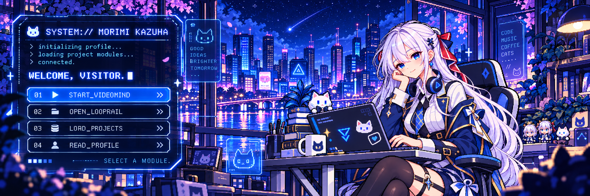

  

## `> SELECT A MODULE`

> [ 01_START_VIDEOMIND ](https://github.com/Morimi-Kazuha/VideoMind) 
> [ 02_OPEN_LOOPRAIL ](https://github.com/Morimi-Kazuha/Looprail-Agent) 
> [ 03_LOAD_PROJECTS ](https://github.com/Morimi-Kazuha?tab=repositories) 
> [ 04_READ_PROFILE ](#user-content-system-status)

## `> FEATURED MODULES`

### [01 // VideoMind](https://github.com/Morimi-Kazuha/VideoMind)

VideoMind is a multimodal AI agent workspace for long-video understanding. It connects ASR/OCR observations to searchable temporal evidence and validates citations, so every grounded answer can lead back through **AI Answer → Citation → Evidence → Timeline → Video**.

`TEMPORAL WINDOWS` · `HYBRID RETRIEVAL` · `EVIDENCE GROUNDING` · `TOKEN BUDGET`

### [02 // Looprail](https://github.com/Morimi-Kazuha/Looprail-Agent)

Looprail is a local-first coding agent runtime for long-running repository tasks. Its governed tool execution, persistent checkpoints, and traces keep agent workflows inspectable and recoverable.

`CONTROLLED TOOLS` · `DURABLE EXECUTION` · `CHECKPOINT / RESUME` · `TRACE + EVALUATION`

## `> CURRENT QUEST`

`[ACTIVE]` Multimodal AI Agents 
`[ACTIVE]` Agent Infrastructure 
`[ACTIVE]` Evidence-Grounded AI 
`[ACTIVE]` Backend Systems 
`[EXPLORING]` Developer Experience 
`[EXPLORING]` Creative AI Interfaces

## `> SYSTEM STATUS`

`LANGUAGE` Python · JavaScript 
`AI / ML` LLM · RAG · Embeddings · Multimodal Agents 
`BACKEND / INFRA` FastAPI · Celery · RabbitMQ · Redis · MySQL · Docker Compose 
`MEDIA / RETRIEVAL` FFmpeg · Whisper · Tesseract OCR · BGE-M3 · Qdrant
